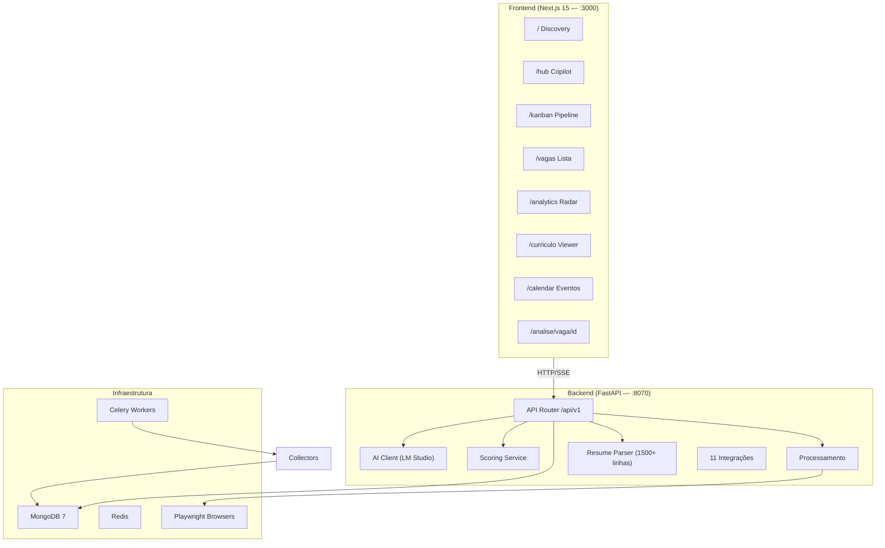
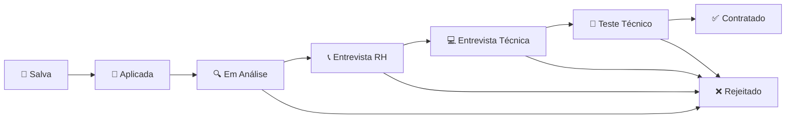
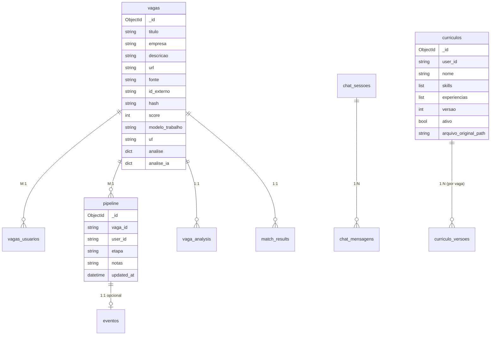

# 🔍 Análise Completa — WorkHunter

> Análise técnica profunda de toda a plataforma, cobrindo arquitetura, funcionalidades, fluxo de dados, IA, anti-detecção, bugs conhecidos e roadmap sugerido.

---

## 1. Visão Geral da Arquitetura

| Camada | Tecnologia | Porta |
|--------|-----------|-------|
| Frontend | Next.js 15 + Tailwind v3 + TypeScript | 3000 |
| Backend | FastAPI + Python 3.11 | 8070 |
| Database | MongoDB 7 (Motor async) | 27017 |
| Queue | Celery + Redis | 6379 |
| Browser | Playwright (Chromium) | — |
| IA | LM Studio (Qwen 3.6 35B) | 1234 |

---

## 2. Módulos e Funcionalidades

### 2.1 Sistema de Coleta (11 Integrações)

| Integração | Método | Status |
|---------|--------|--------|
| `gupy.py` | HTTP API | ✅ Registrado |
| `rss.py` | HTTP (feedparser) | ✅ Registrado |
| `infojobs.py` | HTTP + BS4 | ✅ Registrado |
| `vagasbr.py` | HTTP + BS4 | ✅ Registrado |
| `noventa_e_nove_jobs.py` | HTTP + BS4 | ✅ Registrado |
| `apinfo.py` | HTTP + BS4 | ✅ Registrado |
| `programathor.py` | Playwright | ✅ Registrado |
**Fluxo de coleta:**
1. Celery task `coletar_vagas` → executa cada coletor
2. `DedupService` → filtra duplicatas por hash
3. `ScoringService` → calcula score 0-100 para cada vaga
4. `AnaliseService` → detecta "fake junior"
5. Notificações → Telegram + in-app para vagas com score ≥ 85

---

### 2.2 Sistema de Scoring (0-100 pts)

Implementado em `scoring_service.py`:

| Critério | Peso | Descrição |
|----------|------|-----------|
| Cargo | 0-25 | Match do título com `cargos_alvo` do perfil |
| Skills atuais | 0-40 | Skills do perfil encontradas na descrição |
| Skills aprendendo | 0-10 | Skills em aprendizado |
| Localização | 0-15 | Match com preferências de localização |
| Área foco | 0-10 | Frontend, Backend, IA, etc. |
| Modelo trabalho | 0-20 | Remoto > Híbrido > Presencial |
| Categorias dinâmicas | variável | Bônus/penalidade por categorias do MongoDB |
| Foco Frontend | -40 a +30 | Bônus para front/full, penalidade para outras techs |
| Área irrelevante | -50 | Marketing, vendas, RH, etc. |
| Palavras a evitar | -20/cada | Blacklist do perfil |

---

### 2.3 Pipeline Kanban (8 Etapas)

- Drag & drop no frontend (`KanbanBoard.tsx`)
- Side sheet com detalhes da vaga (`JobDetailSheet.tsx`)
- Eventos de calendário criados automaticamente ao avançar etapa
- Estatísticas por etapa + taxa de conversão

---

### 2.4 Chat IA (Copilot Hub)

Implementado em `ai.py` + `client.py`:

**Arquitetura de IA:**
- **LM Studio:** único provedor de IA local
- **Circuit Breaker:** 5 falhas → 60s de reset
- **Retry:** 3x com exponential backoff + jitter
- **Streaming SSE:** Eventos `token`, `tool_start`, `tool_result`, `done`, `error`
- **Prompts Jinja2:** `vaga_analysis.j2`, `match_scoring.j2`, `cover_letter.j2`

**6 Tools disponíveis no chat:**

| Tool | Função | Persistência |
|------|--------|-------------|
| `analyze_vaga` | Análise profunda (stack, salário, ATS, soft skills) | `vaga_analysis` |
| `calcular_match` | Score de compatibilidade currículo × vaga | `match_results` |
| `analisar_match` | Análise detalhada currículo vs vaga (pontos fortes/fracos, gaps) | — |
| `pipeline_status` | Resumo completo do pipeline | — |
| `gerar_cover_letter` | Cover letter personalizada para a vaga | — |

**Contexto enriquecido por request:**
- 5 vagas recentes com score
- Pipeline stats (contagem por etapa)
- Currículo do usuário (stacks, experiências, projetos)
- Vaga em contexto (se fornecida)

---

| Fonte | Método | Status |
|-------|--------|--------|

| Gupy | HTTP API | ✅ Implementado |
| Outras | — | ❌ Não suportado |

**Proteções:**
- Rate limiting por fonte (max N/dia, persistido em JSON)
- Warmup period gradual
- Detecção automática de fonte via URL + `fonte`
- Logs com TTL de 30 dias no MongoDB
- Modo `dry_run` para teste

---

### 2.6 Currículo (Parser + Viewer)

**Parser** (`resume_parser.py` — **1504 linhas**):
- Extração de texto via `pdfplumber` (PDF)
- Classificação de blocos com scoring multi-dimensional:
  - Fuzzy match de headers (50%)
  - Keywords no body (20%)
  - Structural hints (20%)
  - Negative signals (-10%)
- Detecção de idioma dominante (PT/EN/ES)
- Normalização de 167+ skills conhecidas
- Extração de contato: email, telefone, LinkedIn, GitHub
- Seções suportadas: Experience, Education, Skills, Projects, Certifications, Languages, Summary + custom

**Viewer** (`ResumeViewer.tsx`):
- Exibe PDF original em iframe
- Apenas arquivos PDF suportados

**Export** (`curriculo_export.py`):
- PDF via WeasyPrint
- DOCX via python-docx

---

### 2.7 Analytics (Radar de Mercado)

10 endpoints em `analytics.py`:

| Endpoint | Dados |
|----------|-------|
| `/stacks` | Top stacks mais pedidas |
| `/salarios` | Média salarial por stack |
| `/fontes` | Vagas por fonte (portal) |
| `/senioridade` | Distribuição por nível |
| `/timeline` | Vagas por dia (30d) |
| `/overview` | Total, fake junior, score médio, alertas |
| `/fontes-score` | Score médio/máximo por fonte |
| `/skills` | Skills mais populares |
| `/chat` | Sessões, mensagens, tools executadas |

---

---

### 2.9 Notificações

| Canal | Implementação |
|-------|--------------|
| Telegram | `telegram_bot.py` — match, pipeline, resumo diário |
| In-App | `notification_service.py` — vagas imperdíveis |
| Email | `email_manager.py` — IMAP/SMTP configurável |

---

## 3. Collections MongoDB

**Indexes criados automaticamente** em `database.py`:
- `vagas`: hash (unique), fonte, data_publicacao, score, [fonte+id_externo] (unique)
- `vagas_usuarios`: [user_id+vaga_id] (unique)
- `pipeline`: [user_id+vaga_id] (unique), etapa, updated_at
- `eventos`: [user_id+pipeline_id] (unique, sparse)
- `chat_sessoes`: user_id, [user_id+updated_at]
- `chat_mensagens`: sessao_id, [sessao_id+created_at]
- `vaga_analysis`: [vaga_id+user_id] (unique)
- `match_results`: [vaga_id+user_id] (unique)

---

## 4. Frontend — Mapa de Rotas

| Rota | Página | Componentes Chave |
|------|--------|--------------------|
| `/` | Discovery | Cards de vagas, ScoreRing, Overview stats, Pipeline preview |
| `/hub` | Copilot Hub | HubChat (SSE), VagaBrowserView, HubContext, ShortcutsHelp |
| `/kanban` | Pipeline Kanban | KanbanBoard (DnD), JobDetailSheet |
| `/vagas` | Lista Completa | Filtros avançados (fonte, score, modelo, UF, categoria, busca) |
| `/analise/vaga/[id]` | Análise Completa | Vaga + analysis + match + status + pipeline |
| `/curriculo` | Currículo Viewer | ResumeViewer (iframe PDF), VersaoSidebar, UploadZone |
| `/analytics` | Radar de Mercado | Charts (stacks, salários, fontes, timeline) + Chat Analytics |
| `/calendar` | Calendário | Eventos de entrevistas e follow-ups |

---

## 5. Bugs Conhecidos e Gaps

### 🐛 Bugs Ativos

| Severidade | Descrição | Arquivo |
|------------|-----------|---------|
| 🔴 Alta | `handle_calcular_match` busca currículo por `uploaded_at` ao invés de `ativo=True` — não encontra currículos do novo sistema | `tools.py:172` |
| 🔴 Alta | `handle_gerar_cover_letter` mesmo problema — busca `uploaded_at` | `tools.py:403` |
| 🔴 Alta | `_build_enriched_context` busca currículo por `uploaded_at` — contexto do chat fica vazio | `ai.py:251` |
| 🟡 Média | `handle_pipeline_status` aceita apenas 2 args mas é chamado com 3 (user_id, params, db) | `tools.py:267` |
| 🟡 Média | Currículo antigo no banco com caminho temporário `AppData\Local\Temp` — arquivo não existe mais | DB `curriculos` |
| 🟡 Média | `user_id` hardcoded como `"default"` em todo o backend — sem autenticação real | `auth.py` |

### ⚠️ Gaps Funcionais

| Área | Gap |
|------|-----|

| **Currículo** | `otimizar_curriculo` listado no AGENTS.md mas **não implementado** nos tools |
| **Autenticação** | Sem login/registro — `user_id = "default"` em todo o sistema |
| **Testes** | Arquivos de teste existem (`test_classifier.py`, `test_pipeline.py`) mas sem cobertura significativa |
| **Export** | WeasyPrint é pesado e pode falhar no Windows sem GTK instalado |
| **Chat** | Sem persistência de confirmação do usuário nas tools |

---

## 6. Métricas do Codebase

| Métrica | Valor |
|---------|-------|
| Total de arquivos Python (backend) | ~65 |
| Total de arquivos TSX (frontend) | ~25 |
| Maior arquivo | `resume_parser.py` (1504 linhas, 46KB) |
| Endpoints API | ~50 |
| Collections MongoDB | ~12 |
| Integrações | 11 |
| AI Tools | 6 |
| AI Provider | LM Studio |

---

## 7. Roadmap Sugerido

### Fase 1 — Estabilidade (Próximas Correções)
- [ ] Corrigir busca de currículo nos AI tools (`ativo=True` + `user_id`)
- [ ] Corrigir `handle_pipeline_status` (assinatura de função)

- [ ] Implementar `otimizar_curriculo` tool (mencionado no AGENTS.md)

### Fase 2 — Features
- [ ] Autenticação real (Better Auth ou similar)
- [ ] Suporte multi-usuário
- [ ] Dashboard de métricas de candidatura (taxa de conversão, tempo médio)
- [ ] Notificações push no browser

### Fase 3 — Escala

- [ ] Cache de análises IA (evitar re-análise)
- [ ] Implementar vector search para vagas similares
- [ ] Background job scheduling com UI (ao invés de Celery manual)
